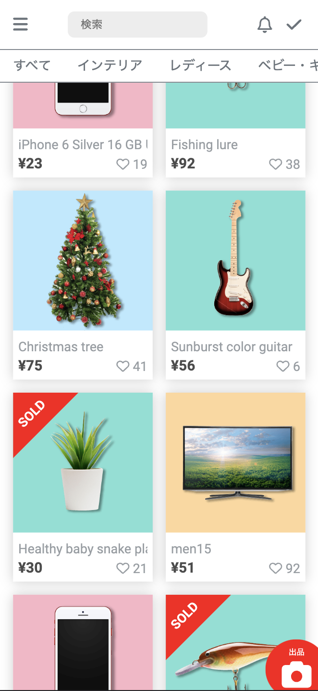

# Mockup Retail app

## Overview

This repository contains the solution for the challenge of implementing a web application using React and TypeScript with the Vite build tool. The application includes an item list page, an item detail page, navbar with search functionality, and category tabs for filtering items. All the pages are responsive and work for both phone and web screen size

<div style="display: flex; align-items: center;">
  
  
</div>

<div style="display: flex; align-items: center;">
  
  
</div>

## Technologies Used
- React
- TypeScript
- Vite
- HTML/CSS


## Setup 

``` shell
$ git clone git@github.com:m-rec/merpay-frontend-template_J264562980.git
$ cd merpay-frontend-template_J264562980/app
$ npm install # or yarn install
$ npm run dev # or yarn dev
$ open http://localhost:5173
```

## Launch API Server

``` shell
$ cd api-server
$ npm start
$ open http://localhost:8000
```

## Production Build
To build the application for production deployment, use the following command:

``` shell
npm run build
```

## Architecture and Strategy
The application follows a component-based architecture and utilizes React and TypeScript with a Vite setup. The main components of the project are:

``` shell
- src/
  - components/  # folder contains corresponding css and test files
    - cards   
      - Cards.tsx
      - ItemCard.tsx
    - navbar 
      - Navbar.tsx
      - ItemNavbar.tsx
    - search 
      - Search.tsx
    - tabs 
      - Tabs.tsx
    - Icons.tsx  # importing icons from font awesome 
  - data/        
    - api  # Contains methods to fetch the API by different GET responses
  - pages/      
    - Home.tsx
    - Category.tsx
    - Item.tsx
    - SearchResults.tsx
  - App.tsx      
  - main.tsx      
- index.html    
- package.json    

```

### components folder

- For each components, there are CSS file and test file.
- Cards.tsx: Cards for item lists page. Grid is used and it is responsive for all devices.
- ItemCard.tsx: Item card for item detail page.
- Navbar.tsx: Responsive navbar for item lists page. menu icon appears for phone width with a toggle function.
- ItemNavbar.tsx: Navbar for item detail page.  The item's name appears in the middle and also be able to make search bar appear by clicking the magnifying glass icon.
- Search.tsx: Search bar for Navbar. It has a dropdown function that shows the suggestions of the search by fetching the API.
- Tabs.tsx: Menu tabs for filtering the items by category_id.


### data folder

- Data folder has a method to fetch the API call by items, item/:id, and categories.

### pages folder

- Home.tsx: Home page "/" Displays the list of items fetched from the API and provides search and filtering functionality.
- Category.tsx: Item list page that is filtered by category "/category/:id"
- Item.tsx: Item page "/item/:id". Represents an individual item detail, displaying relevant information.
- SearchResult.tsx: Result page that shows the results of your search from the navbar.

### Other files

- App.tsx: It sets up the routing using React Router, defining the routes for the item list page and item detail page.
- main.tsx: Entry point for the React application. It renders the App component and mounts it to the HTML template
- index.html: HTML template for the application
- package.json: Project configuration and dependencies


The strategy for implementing the application involved closely following the design specification. The provided API was integrated to fetch item data for display and to provide suggestions for the search functionality. React and TypeScript were used to improve the maintainability of the codebase and ensure type safety. The application was designed to be responsive, allowing for optimal viewing on different devices.

## Testing

The project includes unit tests to ensure the correctness of the implemented functionalities. The tests are written using a testing framework such as Jest and can be executed with the following command:

``` shell
npm run test
```

The tests aim to verify the following:

- The rendering and functionality of the Item List page, Item Detail page, and other components.
- The proper filtering of items based on the search form and category tabs.
- The navigation between pages and the ability to directly access the Item Detail page via URL.
- The integration with the provided API and the correct handling of API responses.


## Code Linting

The project follows code linting rules to ensure consistent code style and maintainability. The linting rules are enforced using a tool such as ESLint, which checks for potential errors and enforces code conventions.

To run the code linting checks, use the following command:

``` shell
npm run lint
```

## Conclusion

To meet the requirements, the following implementation strategy is adopted:

Set up the project: Initialize a new React TypeScript project with Vite setup.

Create component structure: Define the component structure using React components with TypeScript typings.

Fetch and display item data: Implement logic to fetch item data from the provided API and display them in components.

Implement search functionality: Add a search form to the item lists component and filter items based on user input.

Implement category filtering: Add category tabs to the item lists component and filter items based on the selected category.

Implement item detail page: Create the ItemCard  component to display detailed information about a selected item.

Enable direct URL navigation: Implement routing to support direct navigation to every page via URL.

Testing and Linting: Write tests to verify the functionality of critical components and use a linter for code quality.

Building for production: Prepare a production build command using the Vite build system for deployment.

By following this implementation strategy, the project fulfills the requirements using React with TypeScript and Vite setup, ensuring a production-ready application.


