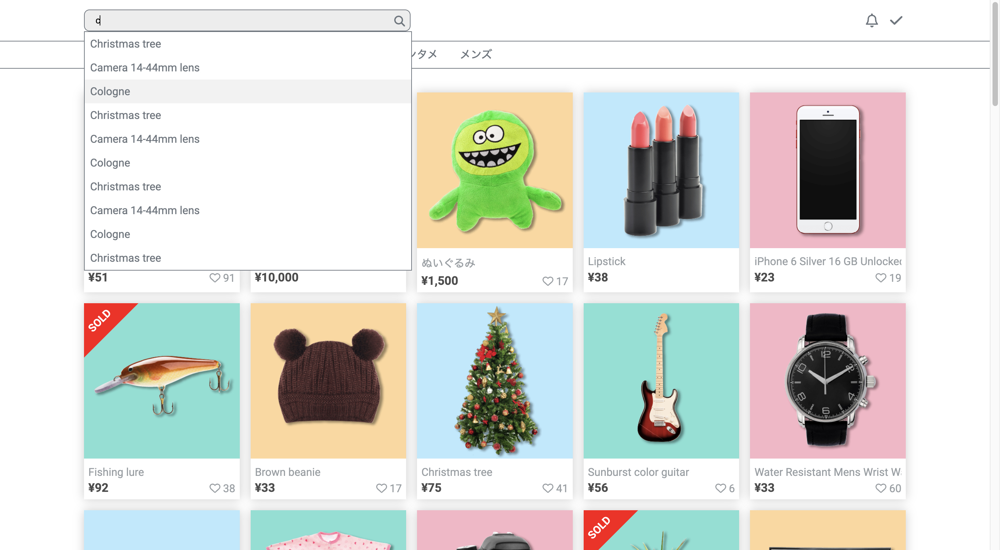
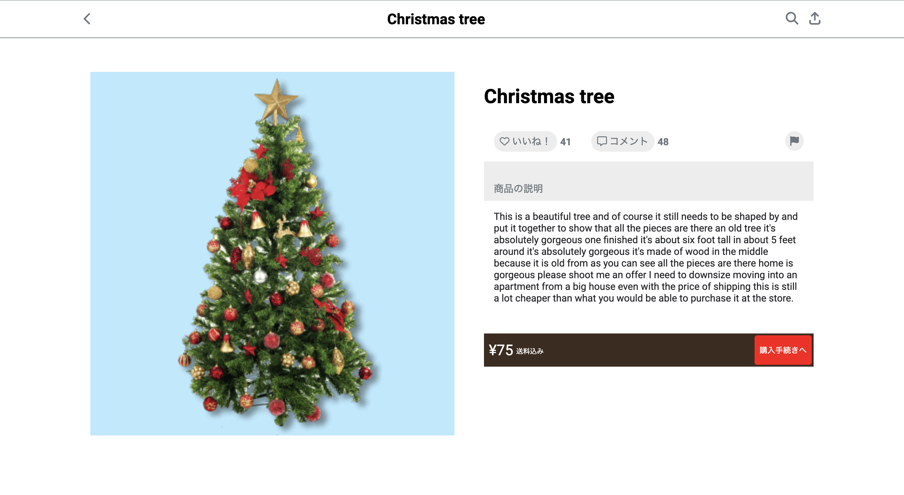
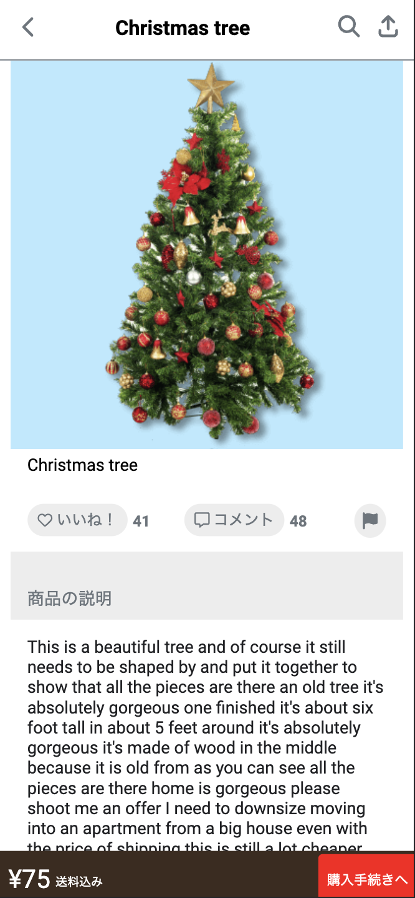

# Mockup Retail app

This repository contains the solution for the challenge of implementing a web application using React and TypeScript with the Vite build tool. The application includes an Item List page, Item Detail page, navbar with search functionality and category tabs for filtering items. All the pages are responsive and works for both phone and web screen size

<div style="display: flex; align-items: center;">
  
  
</div>

<div style="display: flex; align-items: center;">
  
  
</div>

## Technologies Used
- React
- TypeScript
- Vite
- HTML/CSS

## Setup and Usage
1. Clone the repository from GitHub: `git clone git@github.com:m-rec/merpay-frontend-template_J264562980.git`
2. Navigate to the project directory: `cd merpay-frontend-template_J264562980`
3. Install the dependencies: `npm install` or `yarn install`
4. Start the development server: `npm run dev` or `yarn dev`
5. Access the application in your browser at `http://localhost:5173`

### Production Build
To build the application for production deployment, use the following command:

```shell
npm run build
```

## Architecture and Strategy
The application follows a component-based architecture and utilizes React and TypeScript. The main components in the project are:

- `ItemListPage`
- `ItemDetailPage`
- `Navbar`
- `ItemCard`

The strategy for implementing the application involved closely following the design specification. The provided API was integrated to fetch item data for display and to provide suggestions for the search functionality. React and TypeScript were used to improve the maintainability of the codebase and ensure type safety. The application was designed to be responsive, allowing for optimal viewing on different devices.

## Conclusion
The application successfully meets the minimum requirements specified in the challenge. It provides a responsive user interface with an Item List page, Item Detail page, and a navbar with search functionality and category tabs. The codebase is built with React, TypeScript, and Vite, and it is ready for production deployment.

If you have any questions or need further assistance, please don't hesitate to contact me.
